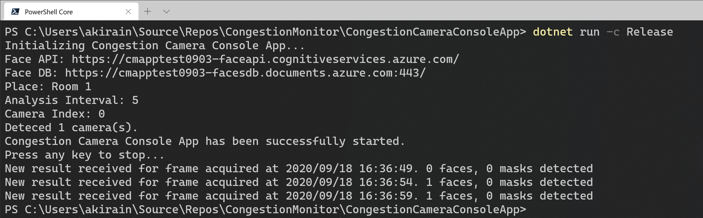
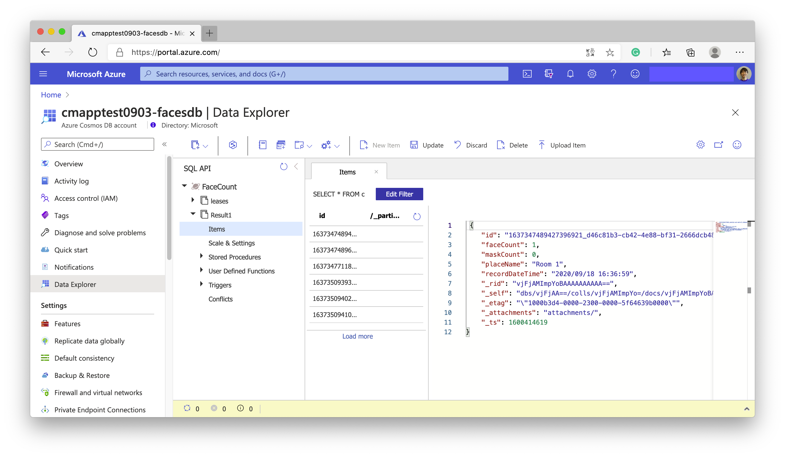

## Build Congestion Camera Console App

This camera console app is built on .NET 5 and requires access to Cosmos DB and Cognitive Service - Face API. For these connections, the application needs the endpoints and keys and keep these value in the local environment securely.

The Secret Manager tool of .NET is one of the good ways to keep secret values in the local environment. It has been already enabled in this console app project and has been added a `UserSecretsId` in the `.csproj` file as follows. If you want to re-create the ID for your own console app, you can replace it with any text but should be unique.

```xml
<PropertyGroup>
  <OutputType>Exe</OutputType>
  <TargetFramework>net5.0</TargetFramework>
  <RuntimeIdentifiers>win-x64;linux-x64;osx-x64</RuntimeIdentifiers>
  <UserSecretsId>mycmcameraapp</UserSecretsId>
</PropertyGroup>
```

Or, you can create it using the following command in the project directory after deleting the `UserSecretsId` line in the `.csproj` file.

```sh
cd CongestionCameraConsoleApp

dotnet user-secrets init
```

### Set secrets

You can see and get the secret values that you need at the deployment output page on your Azure portal.


Then, you run the following command from the directory in which the `CongestionCameraConsoleApp.csproj` file exists and set these secrets.

```sh
cd CongestionCameraConsoleApp

dotnet user-secrets set "Settings:Face_API_Endpoint" "{your face API endpoint url here}"
dotnet user-secrets set "Settings:Face_API_Subscription_Key" "xxxxxxxxxxxxxxxxxxxxxxxxxxx"
dotnet user-secrets set "Settings:FaceCountDB_Endpoint" "{your face count db endpoint url here}"
dotnet user-secrets set "Settings:FaceCountDB_Key" "xxxxxxxxxxxxxxxxxxxxxxxxxxx"
```

Then, the secret values are stored in a JSON configuration file in a system-protected user profile folder on the local machine.

```sh
# Windows
%APPDATA%\Microsoft\UserSecrets\{user_secrets_id}\secrets.json

# Linux / macOS
~/.microsoft/usersecrets/{user_secrets_id}/secrets.json
```

You can also refer to the sample secrets.json file - `sample-secrets.json` in this repository.

### Build the console app

Run the following command from the directory where the `CongestionCameraConsoleApp.csproj` file exists to build the console app for the Congestion Monitor.

```sh
cd CongestionCameraConsoleApp

dotnet build -c Release
```

Once the build has been succeeded, you can see the `CongestionCameraConsoleApp.exe` file in your folder: "CongestionCameraConsoleApp\bin\Release\net5.0\"

Or, you can run the following command to build and run the app directly.

```sh
cd CongestionCameraConsoleApp

dotnet run -c Release
```



Once the Congestion Camera Console App has been successfully started and a web camera has been successfully detected on your PC, and also the app has been successfully connected with Cognitive Services and Cosmos DB, you can see the number of faces that the app detects.

### Another parameters you can modify

If needed, you can modify `appsettings.json` file in the same directory of the `CongestionCameraConsoleApp.exe` to change `PlaceName`, `AnalysisIntervalInSeconds`, and `CameraIndex` parameters.

```json
{
  "Settings": {
    "PlaceName": "Room 1",
    "AnalysisIntervalInSeconds": "5",
    "CameraIndex": "0"
  }
}
```

### Confirm data items in Cosmos DB

Once the camera app has been started, a data item that recorded the face count will be created as `Result1` container in `FaceCount` database of your Cosmos DB account. You can use the Data Explorer in your Cosmos DB account on Azure Portal to see the item.



---
[Home](https://github.com/chack411/CongestionMonitor) | [TOC](https://github.com/chack411/CongestionMonitor#deploy-and-run-with-this-repo-using-azure-cli-and-github-actions) | [Back](deploy-arm-and-function-app.md) | [Next](comfirm-static-web-app.md)
