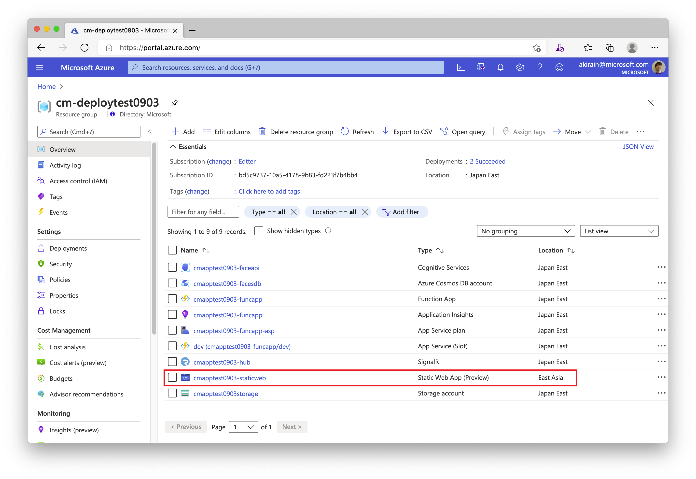
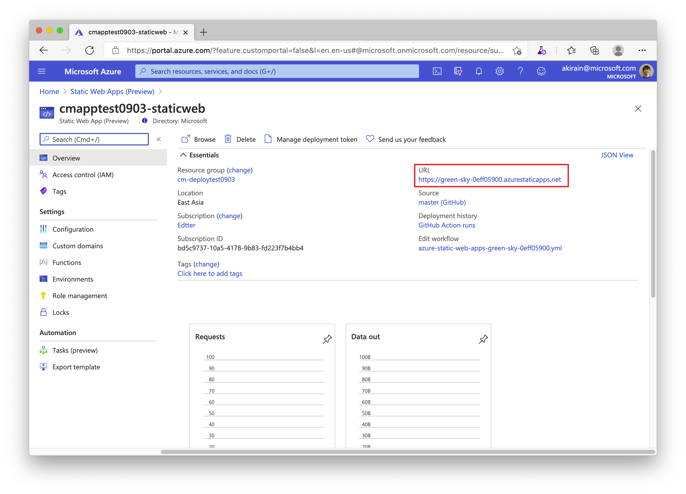
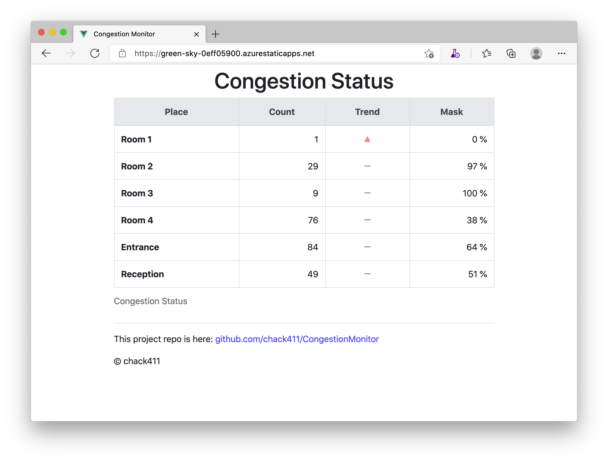
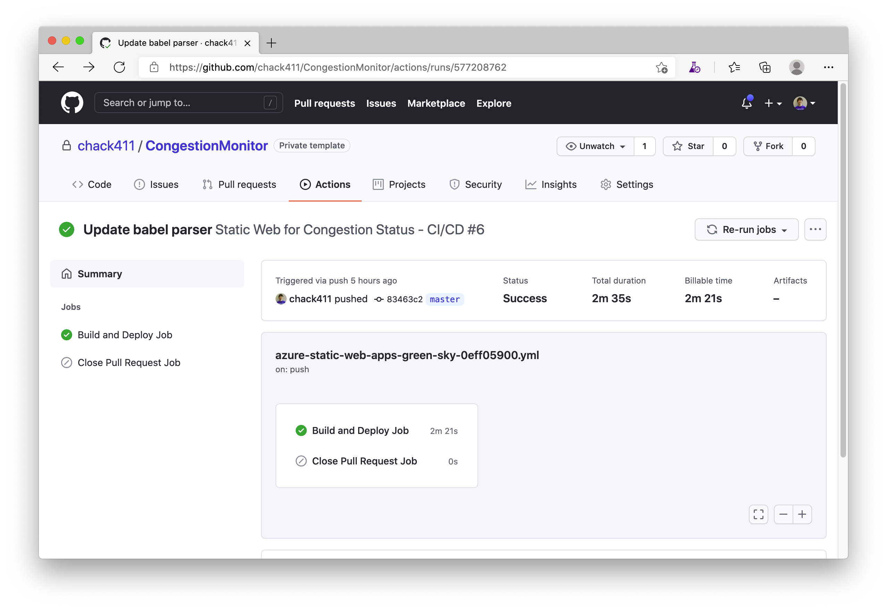

## Confrim Congestion Status on Static Web App

This project is using Azure Static Web Apps for the dashboard to show the congestion monitor status. [Azure Static Web Apps](https://docs.microsoft.com/en-us/azure/static-web-apps/overview) is a service that automatically builds and deploys full stack web apps to Azure from a GitHub repository.

> Azure Static Web Apps can provide serverless API endpoints via Azure Functions. But, triggers are limited to `HTTP` at this moment. In this project, [Change Feed](https://docs.microsoft.com/en-us/azure/cosmos-db/change-feed) of Cosmos DB and `CosmosDBTrigger` of Azure Functions are used. That's why the Function App is separated from the Static Web App project.

Once the deployment has been succeeded, you can see a Static Web App resource in the resource group.

And you can also see the URL on the Static Web App Overview page.

This is an example of the Congestion Status. If you have multiple PC environments with a web camera and set up the Congestion Camera Console App with JSON parameters on each environment, you can monitor multiple states as follows.

This web application is built with Vue.js and is deployed by GitHub Actions workflow.

---
[Home](https://github.com/chack411/CongestionMonitor) | [TOC](https://github.com/chack411/CongestionMonitor#deploy-and-run-with-this-repo-using-azure-cli-and-github-actions) | [Back](build-camera-console-app.md)
