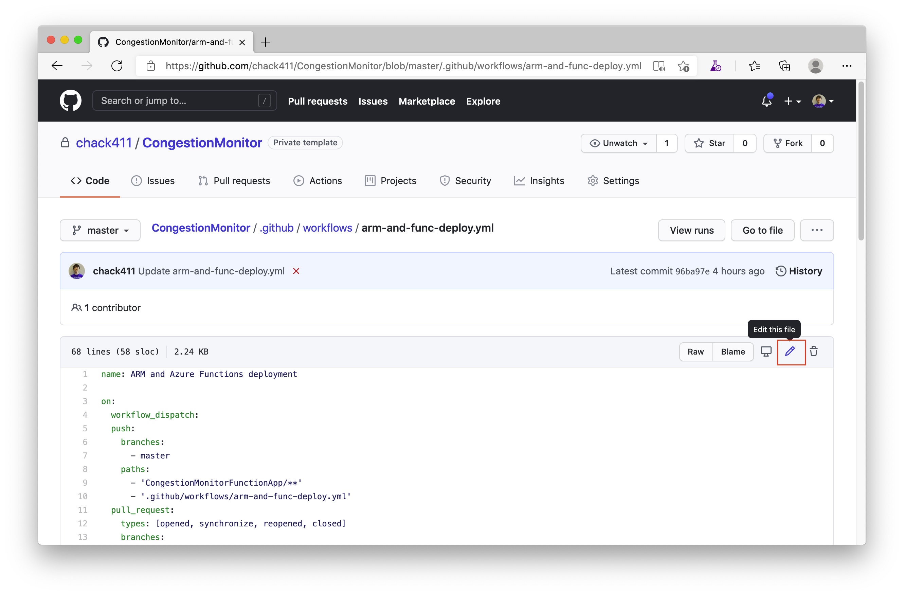
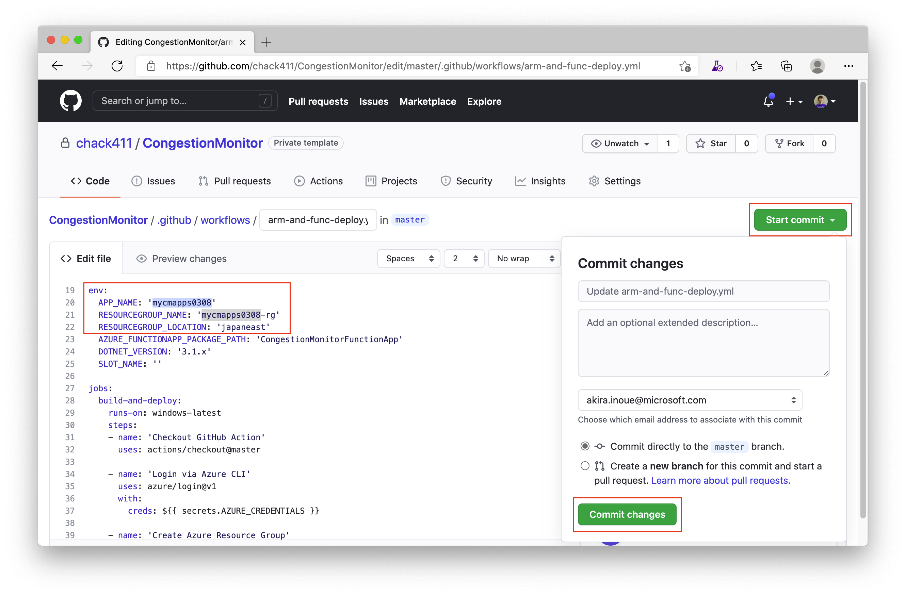
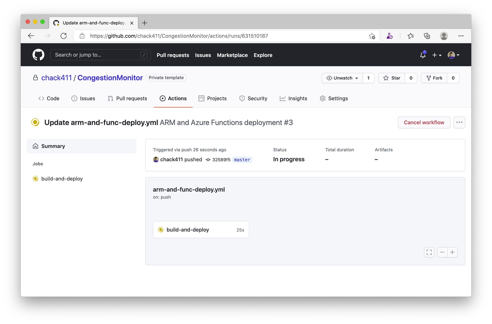
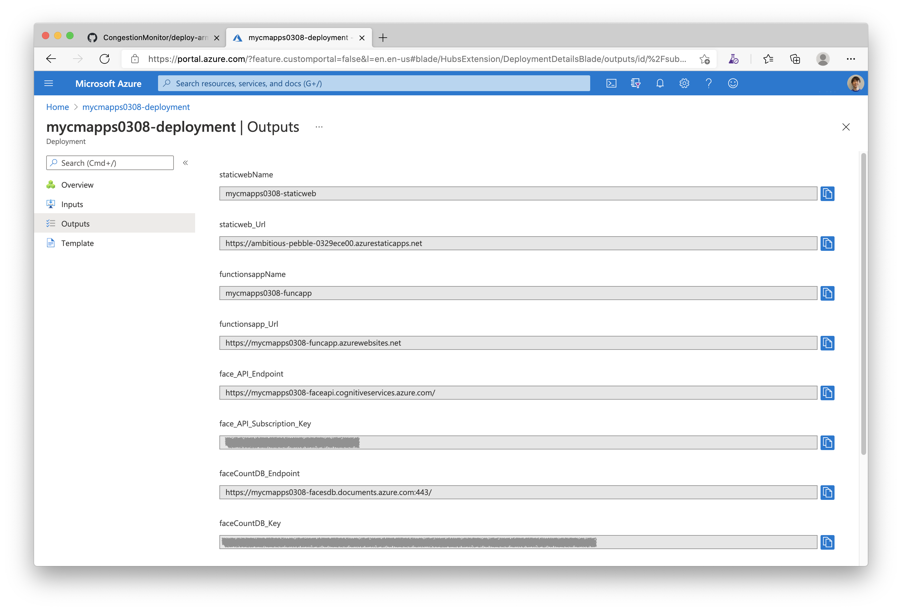

## Prepare environments and deploy Azure resources using GitHub Actions

Let's deploy Congestion Monitor applications using GitHub Actions and ARM Template.

### Preparation

- If you haven't had an Azure subscription yet, you can create an Azure free account at [Create your Azure free account today](https://azure.microsoft.com/en-us/free/).
- If you haven't installed the Azure CLI, please see [Install the Azure CLI](https://docs.microsoft.com/en-us/cli/azure/install-azure-cli?view=azure-cli-latest) and setup it with your Azure subscription.
- If you need more details about the login with the Azure CLI, please see [Sign in with Azure CLI](https://docs.microsoft.com/en-us/cli/azure/authenticate-azure-cli?view=azure-cli-latest).

### Verify subscription

Run the command `az login` and `az account list -o table`
```sh
az login

az account list -o table

Name                     CloudName    SubscriptionId                        State    IsDefault
-----------------------  -----------  ------------------------------------  -------  -----------
My primary subscription  AzureCloud   xxxxxxxxxx-xxxx-xxxx-xxxx-xxxxxxxxxx  Enabled  True
Another sub1             AzureCloud   xxxxxxxxxx-xxxx-xxxx-xxxx-xxxxxxxxxx  Enabled  False
Another sub2             AzureCloud   xxxxxxxxxx-xxxx-xxxx-xxxx-xxxxxxxxxx  Enabled  False
```

If you have more than a subscription, make sure that the subscription that you want to use is set as default using the subscription name:

```sh
az account set -s 'My primary subscription'
```

### Create a service principal with your Azure Subscription

`arm-and-func-deploy.yml` in `.github\workflows` directory is used as a GitHub Actions workflow. It depends on a secret named `AZURE_CREDENTIALS` in your repository. The value of this secret is expected to be a JSON object that represents a service principal (an identifier for an application or process) that authenticates the workflow with Azure.

You can use the `az ad sp create-for-rbac` command to create a service principal and assign a Contributor role as follows. Please replace {sp-name} with a suitable name for your service principal and replace {subscription-id} with your subscription ID (You can see your primary subscription information with `az account show` command).

```sh
az ad sp create-for-rbac \
  --name {sp-name} --sdk-auth --role contributor \
  --scopes /subscriptions/{subscription-id}
```

When complete, the az ad sp create-for-rbac command displays JSON output as follows.

```json
{
  "clientId": "<GUID>",
  "clientSecret": "<GUID>",
  "subscriptionId": "<GUID>",
  "tenantId": "<GUID>",
  (...)
}
```

You need to copy and keep this JSON output as text for the next step.

See [Configure deployment credentials](https://github.com/marketplace/actions/azure-login#configure-deployment-credentials) for more details.

> if you have an error when creating a service principal, and you don't have permission to create it, you need to ask the administrator to create the service principal for you.

### Create a secret with the servicde principal JSON output

Open your GitHub repo of CongestionMonitor and access to `Secrets` in the `Settings` menu, and click `New repository secret`.


Set `AZURE_CREDENTIALS` in the `Name` textbox, paste the `service principal JSON output` that you had above in the `Value` textbox, and click `Add secret`.


### Generate a personal access token (PAT) for GitHub API

Before creating a deployment, you need to generate a GitHub personal access token (PAT) that will be used to access the GitHub API from Azure Static Web Apps deployment with ARM Template.

Access to [Personal Access Tokens page](https://github.com/settings/tokens) in Developer settings at GitHub, and click `Generate new token` button. Then, input the token name in Note, select `repo` and `workflow` at `Select scopes` area, and click `Generate token` button.


You can see the new token only once. So, let's copy and keep it for the next step.


### Create a Secret with the PAT for GitHub API

Open your GitHub repo of CongestionMonitor and access to `Secrets` in the `Settings` menu, and click `New repository secret`.


Set `GH_PAT` in the `Name` textbox, paste `Personal Access Token` that you had above in the `Value` textbox, and click `Add secret`.


### Set your APP_NAME to .env file

Open `.env` file in `CongestionStaticWebVueApp` directory and set a suitable app name to `{APP_NAME}` of `VUE_APP_API_BASE_URL` value. The app name should be unique because it is used as base URL for your Azure Function App.

```text
VUE_APP_API_BASE_URL='https://{APP_NAME}-funcapp.azurewebsites.net'
```

### Commit changes and push your local repository to the GitHub repo.

If you have cloned your repo to your local environment, entering the following commands, you make a change to the files on your computer, commit the changes locally, and push the commit to the repo on GitHub.

```sh
cd CongestionMonitor
git add .
git commit -m "update APP_NAME in .env file"
git push -u origin master
```

> You can also use any development tools like Visual Studio Code or Visual Studio 2019 to commit changes and to push your repo to the repo on GitHub.

### Set your APP_NAME to arm-and-func-deploy.yml file on GitHub repo

Open `arm-and-func-deploy.yml` file at `.github\workflows` on GitHub and click `Edit this file` button to enter edit mode.



Then, set `APP_NAME` value to your application's name the same as that you set at `.env` file in `CongestionStaticWebVueApp` directory. And also, you can set any resource group name and the Azure location that you hope.

```yml
env:
  APP_NAME: '{app name here}'
  RESOURCEGROUP_NAME: 'mycmapps-rg'
  RESOURCEGROUP_LOCATION: 'japaneast'
```

Finally, click `Start commit` button and click `Commit changes` to save the modification.



Once it was updated, GitHub Actions runs the workflow, and the Azure resources and Function App will be deployed.





Once the deployment has been succeeded, you can see resources in the resource group used by the Congestion Monitor.


And also, you can see parameters you need when configuring the camera console apps in the deployment outputs.



---
### (Option) Deploy Azure resources using Azure CLI

If you want to deploy Azure resources manually using Azure CLI, see [Deploy Azure resources with ARM template using Azure CLI](deploy-with-arm-template.md).

---
[Home](https://github.com/chack411/CongestionMonitor) | [TOC](https://github.com/chack411/CongestionMonitor#deploy-and-run-with-this-repo-using-azure-cli-and-github-actions) | [Next](build-camera-console-app.md)
