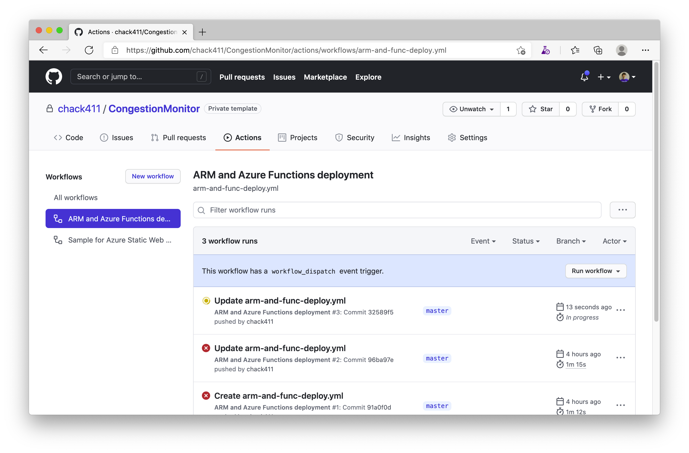

## Deploy Function App for Congestion Monitor

Once the deployment with ARM Template has been succeeded, you can see a Function App resource in the resource group used by the Congestion Monitor. To use the Function App, you need to build and deploy the source codes on the repo to the Function App. In this repo, a workflow file for the Function App has already been prepared. So, you can run the workflow after updating with your `cm_app_name` value as follows.

### Set up Publish Profile for Azure Functions

First, you need to set up Publish Profile for Azure Functions as Actions secrets. Open the Function App on your Azure Portal and click `Get publish profile` to download the profile.


And, open the `Publish Profile (the name is like *.PublishSettings)` in any text editor, select all text, and copy the text to your clipboard.


Open your GitHub repo of CongestionMonitor and access to `Actions secrets` in the `Settings` menu, and click `New repository secret`.


Set `AZURE_FUNCTIONAPP_PUBLISH_PROFILE` in the `Name` textbox, paste `Publish Profile` that you copied to your clipboard above in the `Value` textbox, and click `Add secret`.


### Set your cm_app_name to azure-functions-apps.yml file on GitHub repo

Open `azure-functions-apps.yml` file at `CongestionMonitor\.github\workflows` on GitHub and click `Edit this file` button to enter edit mode.


Then, set `<cm_app_name>` to your application's name that you set at `parameters.json` in `CongestionMonitor/ARMTemplate`.

```yml
env:
  AZURE_FUNCTIONAPP_NAME: <cm_app_name>-funcapp  # set <cm_app_name> to your application's name
```

Finally, click `Start commit` button and click `Commit changes` to save the modification.


Once it was updated, GitHub Actions runs the workflow and the Function App will be deployed.




---
[Home](../README.md) | [Back](build-camera-console-app.md) | [Next](comfirm-static-web-app.md)
