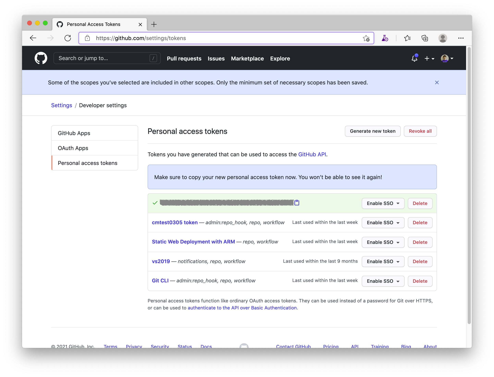
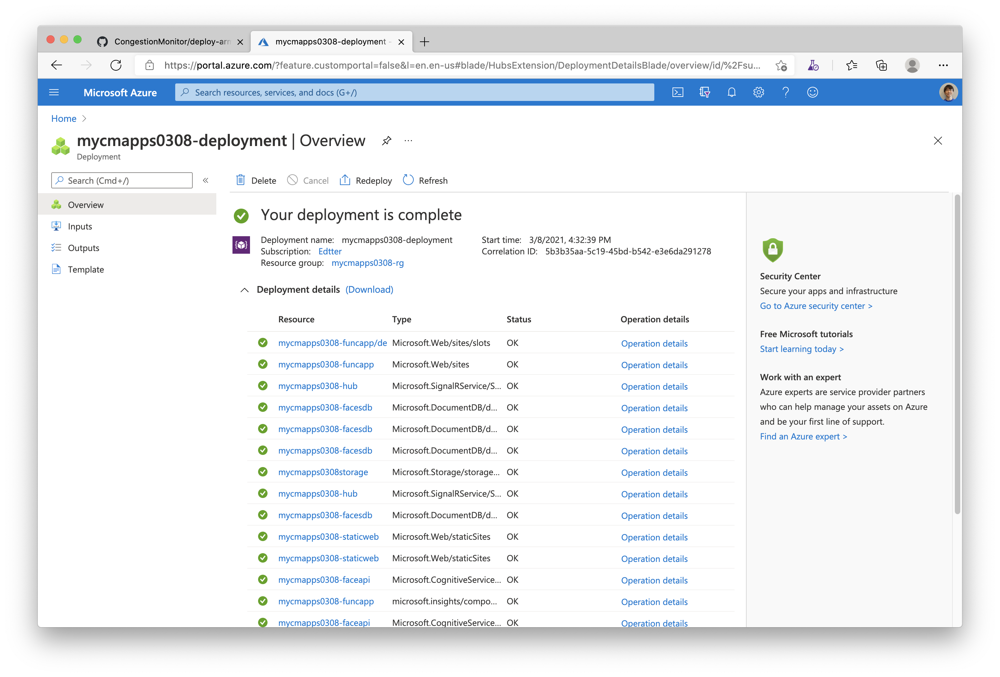

## Deploy Azure resources with ARM template using Azure CLI

Let's deploy Congestion Monitor applications using Azure CLI and ARM Template.

### Preparation

- If you haven't had an Azure subscription yet, you can create an Azure free account at [Create your Azure free account today](https://azure.microsoft.com/en-us/free/).
- If you haven't installed the Azure CLI, please see [Install the Azure CLI](https://docs.microsoft.com/en-us/cli/azure/install-azure-cli?view=azure-cli-latest) and setup it with your Azure subscription.
- If you need more details about the login with the Azure CLI, please see [Sign in with Azure CLI](https://docs.microsoft.com/en-us/cli/azure/authenticate-azure-cli?view=azure-cli-latest).

### Verify subscription

Run the command `az login` and `az account list -o table`
```sh
az login

az account list -o table

Name                     CloudName    SubscriptionId                        State    IsDefault
-----------------------  -----------  ------------------------------------  -------  -----------
My primary subscription  AzureCloud   xxxxxxxxxx-xxxx-xxxx-xxxx-xxxxxxxxxx  Enabled  True
Another sub1             AzureCloud   xxxxxxxxxx-xxxx-xxxx-xxxx-xxxxxxxxxx  Enabled  False
Another sub2             AzureCloud   xxxxxxxxxx-xxxx-xxxx-xxxx-xxxxxxxxxx  Enabled  False
```

If you have more than a subscription, make sure that the subscription that you want to use is set as default using the subscription name:

```sh
az account set -s 'My primary subscription'
```

### Generate a personal access token (PAT) for GitHub API

Before creating a deployment, you need to generate a GitHub personal access token that will be used to access the GitHub API from Azure Static Web Apps deployment with ARM Template.

Access to [Personal Access Tokens page](https://github.com/settings/tokens) in Developer settings at GitHub, and click `Generate new token` button. Then, input the token name in Note, select `repo` and `workflow` at `Select scopes` area, and click `Generate token` button.


You can see the new token only once. So, let's copy and keep it for the next step.



### Modify parameters for your deployment

You need to modify `parameters.json` in `ARMTemplate` with your own parameters.

```json
{
    "$schema": "https://schema.management.azure.com/schemas/2015-01-01/deploymentParameters.json#",
    "contentVersion": "1.0.0.0",
    "parameters": {
        "cm_app_name": {
            "value": "{app resource prefix is here. Ex: mycmapptest}"
        },
        "sites_cm_repositoryUrl": {
            "value": "https://github.com/{yourAccountName}/{yourRepoName}"
        },
        "sites_cm_repositoryToken": {
            "value": ""
        }
    }
}
```

> You can write your GitHub personal access token that you created above at the value of `sites_cm_repositoryToken` in `parameters.json`. But, to avoid committing the `parameters.json` with the token to a public repository, recommend to set the token as a parameter when creating a deployment using `az deployment group create` as follows.

### Set your cm_app_name to .env file

Open `.env` file in `CongestionStaticWebVueApp` directory and set `<cm_app_name>` that you set in `parameters.json` to `{APP_NAME}` of `VUE_APP_API_BASE_URL` value. The app name should be unique because it is used as base URL for your Azure Function App.

```text
VUE_APP_API_BASE_URL='https://{APP_NAME}-funcapp.azurewebsites.net'
```

### Commit changes and push your local repository to the GitHub repo.

If you have cloned your repo to your local environment, entering the following commands, you make a change to the files on your computer, commit the changes locally, and push the commit to the repo on GitHub.

```sh
cd CongestionMonitor
git add .
git commit -m "update cm_app_name in .env file"
git push -u origin master
```

> You can also use any development tools like Visual Studio Code or Visual Studio 2019 to commit changes and to push your repo to the repo on GitHub.

### Create a deployment and start to deploy

OK, it's time to deploy with ARM template. Let's create a deployment from a local template file: `template.json`, using parameters from a local JSON file: `parameters.json`.

```sh
cd ARMTemplate

az group create -g {yourResourceGroupName} -l japaneast

az deployment group create \
  --name {yourDeploymentName} \
  --resource-group {yourResourceGroupName} \
  --template-file template.json \
  --parameters @parameters.json \
  --parameters sites_cm_repositoryToken={GitHub personal access token here}
```



Once the deployment has been succeeded, you can see resources in the resource group used by the Congestion Monitor.


And also, you can see parameters you need when configuring the camera console apps in the deployment outputs.

---
[Home](https://github.com/chack411/CongestionMonitor) | [TOC](https://github.com/chack411/CongestionMonitor#deploy-and-run-with-this-repo-using-azure-cli-and-github-actions) | [Back](deploy-arm-and-function-app.md#option-deploy-azure-resources-using-azure-cli)
