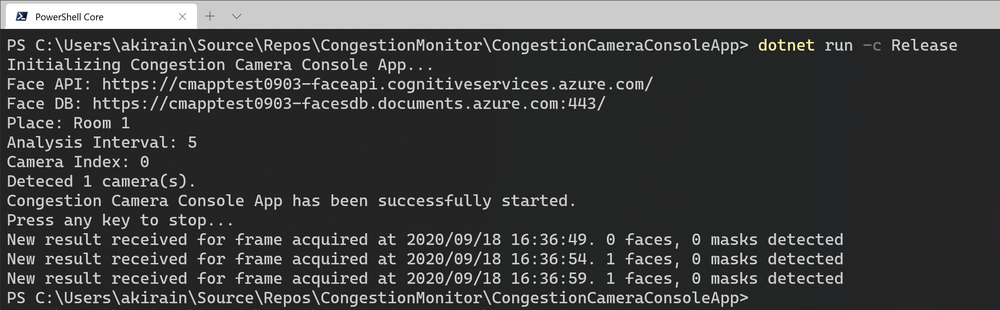

# Congestion Monitor

This repo is the Congestion Monitor project to detect congestion situations through web cameras in real time.

A few weeks ago, I realized that I have created a demo for my customer last year that the application is to detect faces and to show the number and the trend on the browser in realtime. Now, we are facing the COVID-19 situation, and the demand of congestion monitoring is getting higher. So, I decided to rebuild the demo application I created last year and to publish the repo as an Open Source.

One of the important things is that most people have a mask on the face right now, so the capability of mask detection is required such an application. Fortunately, the Azure Cognitive Services - Face API can detect a face with a (small) mask. But, unfortunately, a large mask could result in no face to be detected and the recognition rate with a mask is not good. But, if needed, you can replace the face recognition to other AI services for the improvement of the recognition rate.


## Architecture


## Technology stack

* .NET Core 3.1
* Vue.js
* Azure Functions
* Azure SignalR Service
* Azure Cosmos DB
* Azure Cognitive Services
* Azure Static Web Apps
* Azure Storage
* Azure Application Insights
* Azure Resource Manager
* Azure DevOps
* GitHub Actions

## How to use source codes in this repo

This repo is setting up as Template repository. So, you can create a new GitHub repo from this repo at [Use this template](https://github.com/chack411/CongestionMonitor/generate).


After that, clone your repo on GitHub to your local environment and start to develop your own the Congestion Monitor!

```sh
git clone https://github.com/(your repo name)/CongestionMonitor.git
```

## How to deploy with this repo manually

Let's deploy the Congestion Monitor applications using Azure CLI and ARM Template.

### Preparation

- If you haven't had an Azure subscription yet, you can create an Azure free account at [Create your Azure free account today](https://azure.microsoft.com/en-us/free/).
- If you haven't install the Azure CLI, please see [Install the Azure CLI](https://docs.microsoft.com/en-us/cli/azure/install-azure-cli?view=azure-cli-latest) and setup the CLI with your Azure subscription.
- If you need more details about the login with the CLI, please see [Sign in with Azure CLI](https://docs.microsoft.com/en-us/cli/azure/authenticate-azure-cli?view=azure-cli-latest).

### Verify subscription

Run the command az account list -o table
```sh
az account list -o table

Name                     CloudName    SubscriptionId                        State    IsDefault
-----------------------  -----------  ------------------------------------  -------  -----------
My primary subscription  AzureCloud   xxxxxxxxxx-xxxx-xxxx-xxxx-xxxxxxxxxx  Enabled  True
Another sub1             AzureCloud   xxxxxxxxxx-xxxx-xxxx-xxxx-xxxxxxxxxx  Enabled  False
Another sub2             AzureCloud   xxxxxxxxxx-xxxx-xxxx-xxxx-xxxxxxxxxx  Enabled  False
```

If you have more than subscription, make sure that subscription is set as default using the subscription name:

```sh
az account set -s 'My primary subscription'
```

### Generate a personal access token (PAT) for GitHub API

Before create a deployment, you need to generate a personal access token of GitHub that is used to access the GitHub API from Azure Static Web deployment with ARM Template.

Access to [Personal Access Tokens page](https://github.com/settings/tokens) in Developer settings at GitHub, and click `Generate new token` button. Then, input the token name in Note, and select `repo` and `workflow` at `Select scopes` area, and click `Generate token` button.


So, you can see and copy the new token only once. Let's copy and keep the token for the next step.


### Modify parameters for your deployment

You need to modify `parameters.json` in `CongestionMonitor/ARMTemplate` with your own parameters.

```json
{
    "$schema": "https://schema.management.azure.com/schemas/2015-01-01/deploymentParameters.json#",
    "contentVersion": "1.0.0.0",
    "parameters": {
        "cm_app_name": {
            "value": "(app resource prefix is here. Ex: mycmapptest)"
        },
        "sites_cm_repositoryUrl": {
            "value": "https://github.com/(your repo name)/CongestionMonitor"
        },
        "sites_cm_repositoryToken": {
            "value": "(personal access token here)"
        }
    }
}
```

### Create a resource group

```sh
az group create -g mycmapps-rg -l japaneast
```

### Create a deployment and start to deploy

OK, it's time to deploy with ARM template. Let's create a deployment at the resource group from a local template file: `template.json`, using parameters from a local JSON file: `parameters.json`.

```sh
cd CongestionMonitor/ARMTemplate

az deployment group create \
  --name cm-arm-deployment \
  --resource-group mycmapps-rg \
  --template-file template.json --parameters @parameters.json
```

TODO: screenshot of cli and deployment on azure portal

Once the deployment has been succeeded, you can see resources at the resource group that Congestion Monitor uses.

And also, you can see parameters at the deployment outputs that you need when you configure.

### Build the Congestion Camera Console App

This Camera console app is build on .NET Core and need to access Cognitive Service - Face API and Cosmos DB. For these connections, the application need the endpoints and keys and keep these value in the local environment securely.

The Secret Manager tool of .NET Core is one of the good way to keep secret values in the local environment. It has been already enabled in this console app project and has been added a `UserSecretsId` in the `.csproj` file as follows.

```xml
<PropertyGroup>
  <OutputType>Exe</OutputType>
  <TargetFramework>netcoreapp3.1</TargetFramework>
  <RuntimeIdentifiers>win-x64;linux-x64;osx-x64</RuntimeIdentifiers>
  <UserSecretsId>539c2291-103b-46e2-add4-dab7423af9da</UserSecretsId>
</PropertyGroup>
```

If you want to re-create the ID for your own console app, you can replace it to any text but is unique. Or, you can create it using following command in the project directory.

```sh
dotnet user-secrets init
```

The secret values are stored in a JSON configuration file in a system-protected user profile folder on the local machine.

```sh
# Windows
%APPDATA%\Microsoft\UserSecrets\<user_secrets_id>\secrets.json

# Linux / macOS
~/.microsoft/usersecrets/<user_secrets_id>/secrets.json
```

#### Set secrets

First, you can see the secret values that you need at the deployment output page of your resource group on your Azure portal.

TODO: screen short deployment output

Then, you set these secrets to run the following command from the directory in which the `.csproj` file exists. You can see the secret values that you need at the deployment output page of your resource group on your Azure portal.

```sh
dotnet user-secrets set "Settings:Face_API_Endpoint" "<your face API endpoint url here>"
dotnet user-secrets set "Settings:Face_API_Subscription_Key" "xxxxxxxxxxxxxxxxxxxxxxxxxxx"
dotnet user-secrets set "Settings:FaceCountDB_Endpoint" "<your face count db endpoint url here>"
dotnet user-secrets set "Settings:FaceCountDB_Key" "xxxxxxxxxxxxxxxxxxxxxxxxxxx"
```

You can also refer the sample secrets.json file - `sample-secrets.json` in your repogitory.

#### Build the console app

To run the following command from the directory in which the `.csproj` file exists, you can build the console app for the Congestion Monitor.

```sh
dotnet build -c Release
```

Once the build has been scseeded, you can see `CongestionCameraConsoleApp.exe` file in your folder: "CongestionMonitor\CongestionCameraConsoleApp\bin\Release\netcoreapp3.1\"

Or, you can build and run the app directly to run the following command.

```sh
dotnet run -c Release
```



Once the Congestion Camera Console App has been successfully started and a web camera has been successfully detected on your PC, and also the app has been successfully connected with Cognitive Services and Cosmos DB, you can see the number of faces that the app detects.

### another parameters you can modify

to be updated

## CI/CD deployment using Azure DevOps

To be updated...

## Azure deployment

[](https://portal.azure.com/#create/Microsoft.Template/uri/https://github.com/chack411/CongestionMonitor/blob/master/ARMTemplates/template.json)

## Build Status

|Project|Status|
|---:|:---|
|Azure Functions App|[](https://dev.azure.com/akirain/Congestion%20Monitor/_build/latest?definitionId=71&branchName=master)|
|Camera Console App|[](https://dev.azure.com/akirain/Congestion%20Monitor/_build/latest?definitionId=72&branchName=master)|
|Static Vue App||

## Contributing

This project has adopted the [Microsoft Open Source Code of Conduct](https://opensource.microsoft.com/codeofconduct/). For more information see the [Code of Conduct FAQ](https://opensource.microsoft.com/codeofconduct/faq/) or contact [opencode@microsoft.com](mailto:opencode@microsoft.com) with any additional questions or comments.
