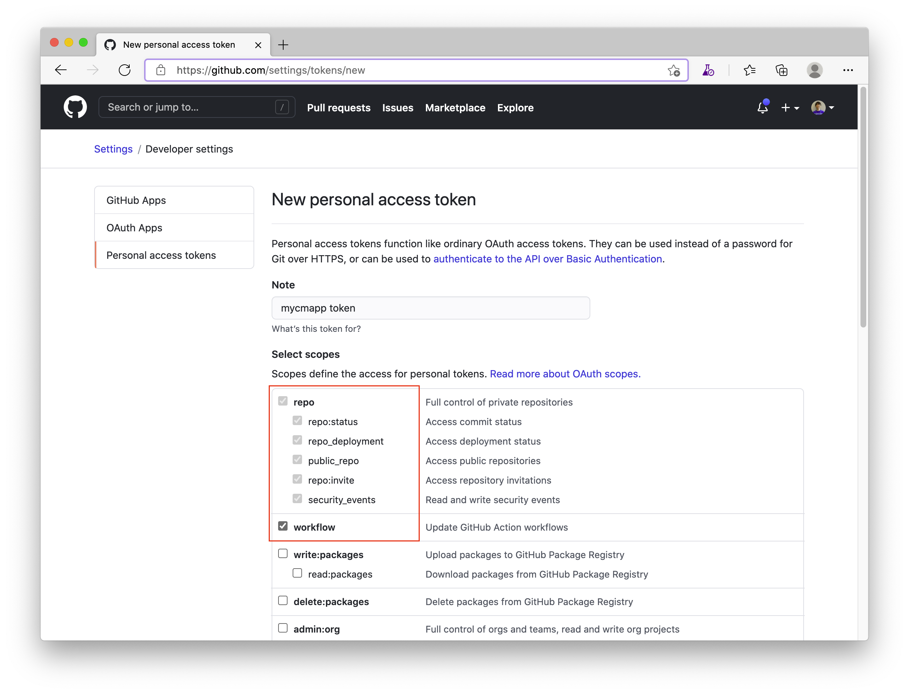
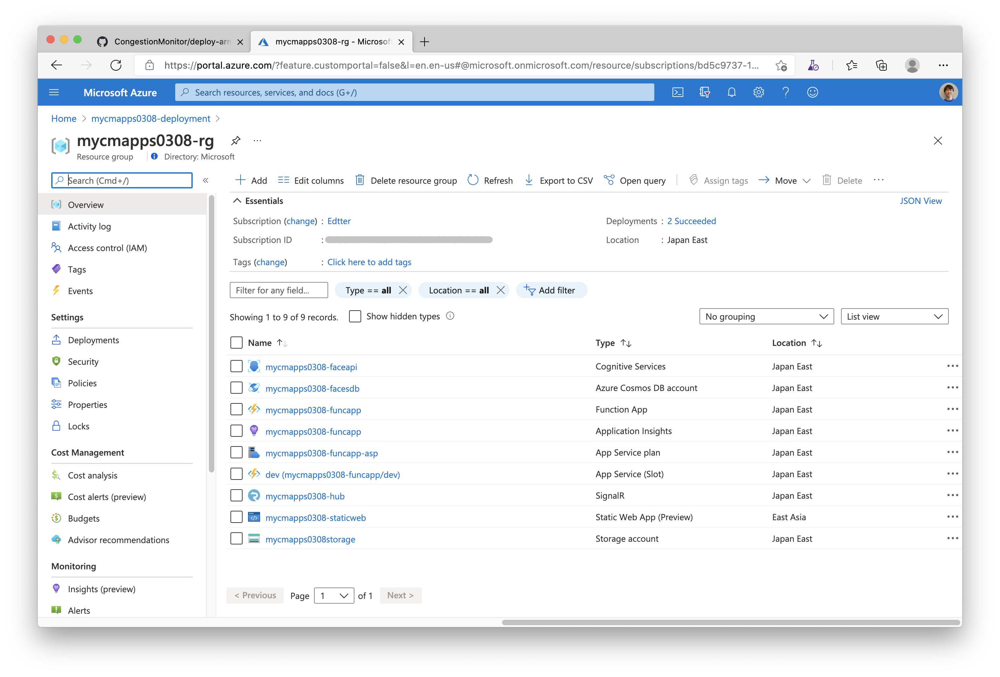
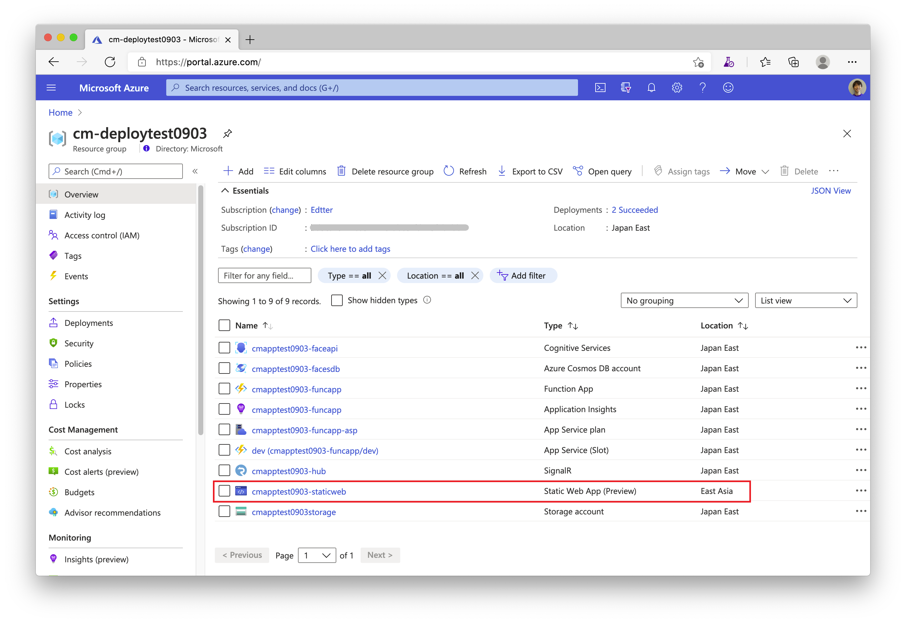
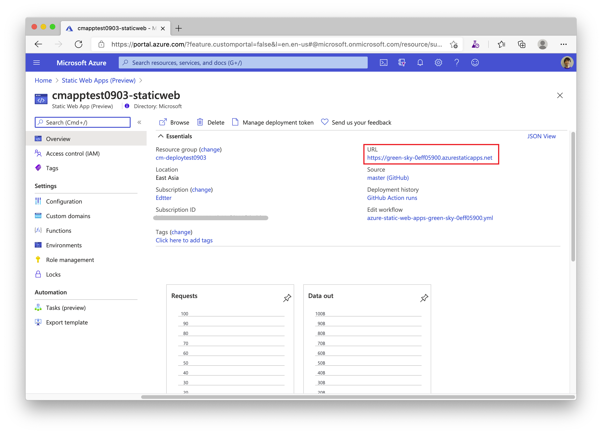
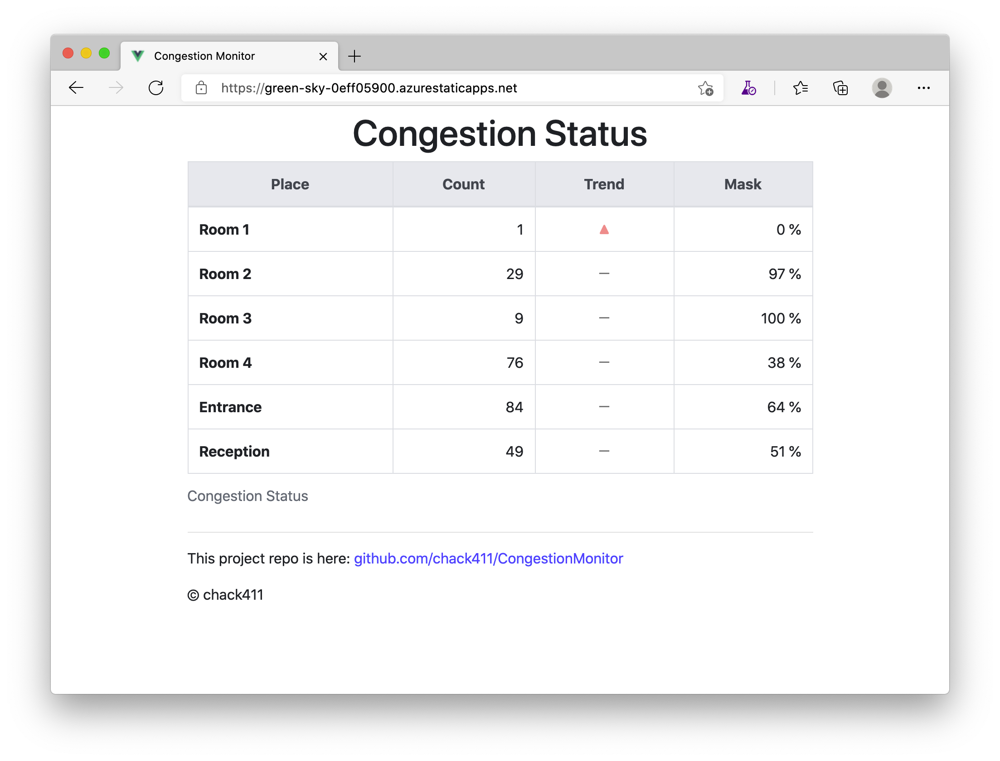

# Congestion Monitor

This repo is the Congestion Monitor project to detect congestion situations through web cameras in real-time.

In 2020, I realized that I have created a demo for my customer in 2019 that the application is to detect faces and to show the number and the trend on the browser in realtime. Now, we are facing the COVID-19 situation, and the demand for congestion monitoring is getting higher. So, I decided to rebuild the demo application that I've created and to publish the repo as an Open Source.

One of the important things is that most people have a mask on the face right now, so the capability of mask detection is required such an application. Fortunately, the Azure Cognitive Services - Face API can detect a face with a (small) mask. But, unfortunately, a large mask could result in no face being detected and the recognition rate with a mask is not good. But, if needed, you can replace face recognition with other AI services for the improvement of the recognition rate.


## Architecture


## Technology stack

* .NET 5
* Vue.js
* Azure Functions
* Azure SignalR Service
* Azure Cosmos DB
* Azure Cognitive Services
* Azure Static Web Apps
* Azure Storage
* Azure Application Insights
* Azure Resource Manager
* Azure DevOps/Pipelines
* GitHub Actions

## How to use source codes in this repo

This repo is setting up as a Template Repository. So, you can create a new GitHub repo from this repo at ["Use this template"](https://github.com/chack411/CongestionMonitor/generate).


After that, clone your repo on GitHub to your local environment and start to develop your own Congestion Monitor!

```sh
git clone https://github.com/<yourRepoName>/CongestionMonitor.git
```

## How to deploy with this repo manually

Let's deploy Congestion Monitor applications using Azure CLI and ARM Template.

### Preparation

- If you haven't had an Azure subscription yet, you can create an Azure free account at [Create your Azure free account today](https://azure.microsoft.com/en-us/free/).
- If you haven't installed the Azure CLI, please see [Install the Azure CLI](https://docs.microsoft.com/en-us/cli/azure/install-azure-cli?view=azure-cli-latest) and setup it with your Azure subscription.
- If you need more details about the login with the Azure CLI, please see [Sign in with Azure CLI](https://docs.microsoft.com/en-us/cli/azure/authenticate-azure-cli?view=azure-cli-latest).

### Verify subscription

Run the command az account list -o table
```sh
az account list -o table

Name                     CloudName    SubscriptionId                        State    IsDefault
-----------------------  -----------  ------------------------------------  -------  -----------
My primary subscription  AzureCloud   xxxxxxxxxx-xxxx-xxxx-xxxx-xxxxxxxxxx  Enabled  True
Another sub1             AzureCloud   xxxxxxxxxx-xxxx-xxxx-xxxx-xxxxxxxxxx  Enabled  False
Another sub2             AzureCloud   xxxxxxxxxx-xxxx-xxxx-xxxx-xxxxxxxxxx  Enabled  False
```

If you have more than a subscription, make sure that the subscription that you want to use is set as default using the subscription name:

```sh
az account set -s 'My primary subscription'
```

### Generate a personal access token (PAT) for GitHub API

Before creating a deployment, you need to generate a GitHub personal access token that will be used to access the GitHub API from Azure Static Web Apps deployment with ARM Template.

Access to [Personal Access Tokens page](https://github.com/settings/tokens) in Developer settings at GitHub, and click `Generate new token` button. Then, input the token name in Note, select `repo` and `workflow` at `Select scopes` area, and click `Generate token` button.



You can see the new token only once. So, let's copy and keep it for the next step.


### Modify parameters for your deployment

You need to modify `parameters.json` in `CongestionMonitor/ARMTemplate` with your own parameters.

```json
{
    "$schema": "https://schema.management.azure.com/schemas/2015-01-01/deploymentParameters.json#",
    "contentVersion": "1.0.0.0",
    "parameters": {
        "cm_app_name": {
            "value": "<app resource prefix is here. Ex: mycmapptest>"
        },
        "sites_cm_repositoryUrl": {
            "value": "https://github.com/<your repo name>/CongestionMonitor"
        },
        "sites_cm_repositoryToken": {
            "value": "<personal access token here>"
        }
    }
}
```

### Create a deployment and start to deploy

OK, it's time to deploy with ARM template. Let's create a deployment from a local template file: `template.json`, using parameters from a local JSON file: `parameters.json`.

```sh
cd CongestionMonitor/ARMTemplate

az group create -g <yourResourceGroupName> -l japaneast

az deployment group create \
  --name <yourDeploymentName> \
  --resource-group <yourResourceGroupName> \
  --template-file template.json --parameters @parameters.json
```


Once the deployment has been succeeded, you can see resources in the resource group used by the Congestion Monitor.



And also, you can see parameters you need when configuring the camera console apps in the deployment outputs.

### Build the Congestion Camera Console App

This camera console app is built on .NET 5 and requires access to Cosmos DB and Cognitive Service - Face API. For these connections, the application needs the endpoints and keys and keep these value in the local environment securely.

The Secret Manager tool of .NET is one of the good ways to keep secret values in the local environment. It has been already enabled in this console app project and has been added a `UserSecretsId` in the `.csproj` file as follows.

```xml
<PropertyGroup>
  <OutputType>Exe</OutputType>
  <TargetFramework>net5.0</TargetFramework>
  <RuntimeIdentifiers>win-x64;linux-x64;osx-x64</RuntimeIdentifiers>
  <UserSecretsId>539c2291-103b-46e2-add4-dab7423af9da</UserSecretsId>
</PropertyGroup>
```

If you want to re-create the ID for your own console app, you can replace it with any text but should be unique. Or, you can create it using the following command in the project directory.

```sh
cd CongestionMonitor/CongestionCameraConsoleApp

dotnet user-secrets init
```

The secret values are stored in a JSON configuration file in a system-protected user profile folder on the local machine.

```sh
# Windows
%APPDATA%\Microsoft\UserSecrets\<user_secrets_id>\secrets.json

# Linux / macOS
~/.microsoft/usersecrets/<user_secrets_id>/secrets.json
```

#### Set secrets

You can see and get the secret values that you need at the deployment output page on your Azure portal.


Then, you run the following command from the directory in which the `CongestionCameraConsoleApp.csproj` file exists and set these secrets.

```sh
cd CongestionMonitor/CongestionCameraConsoleApp

dotnet user-secrets set "Settings:Face_API_Endpoint" "<your face API endpoint url here>"
dotnet user-secrets set "Settings:Face_API_Subscription_Key" "xxxxxxxxxxxxxxxxxxxxxxxxxxx"
dotnet user-secrets set "Settings:FaceCountDB_Endpoint" "<your face count db endpoint url here>"
dotnet user-secrets set "Settings:FaceCountDB_Key" "xxxxxxxxxxxxxxxxxxxxxxxxxxx"
```

You can also refer to the sample secrets.json file - `sample-secrets.json` in your repository.

#### Build the console app

Run the following command from the directory where the `CongestionCameraConsoleApp.csproj` file exists to build the console app for the Congestion Monitor.

```sh
cd CongestionMonitor/CongestionCameraConsoleApp

dotnet build -c Release
```

Once the build has been succeeded, you can see the `CongestionCameraConsoleApp.exe` file in your folder: "CongestionMonitor\CongestionCameraConsoleApp\bin\Release\net5.0\"

Or, you can run the following command to build and run the app directly.

```sh
cd CongestionMonitor/CongestionCameraConsoleApp

dotnet run -c Release
```


Once the Congestion Camera Console App has been successfully started and a web camera has been successfully detected on your PC, and also the app has been successfully connected with Cognitive Services and Cosmos DB, you can see the number of faces that the app detects.

### Another parameters you can modify

If needed, you can modify `appsettings.json` file in the same directory of the `CongestionCameraConsoleApp.exe` to change `PlaceName`, `AnalysisIntervalInSeconds`, and `CameraIndex` parameters.

```json
{
  "Settings": {
    "PlaceName": "Room 1",
    "AnalysisIntervalInSeconds": "5",
    "CameraIndex": "0"
  }
}
```

### Confirm data items in Cosmos DB

Once the camera app has been started, a data item that recorded the face count will be created as `Result1` container in `FaceCount` database of your Cosmos DB account. You can use the Data Explorer in your Cosmos DB account on Azure Portal to see the item.


### Confrim Congestion Status on Static Web App

This project is using Azure Static Web Apps for the dashboard to show the congestion monitor status. [Azure Static Web Apps](https://docs.microsoft.com/en-us/azure/static-web-apps/overview) is a service that automatically builds and deploys full stack web apps to Azure from a GitHub repository.

Once the deployment has been succeeded, you can see a Static Web App resource in the resource group.



And you can also see the URL on the Static Web App Overview page.



This is an example of the Congestion Status. If you have multiple PC environments with a web camera and set up the Congestion Camera Console App with JSON parameters on each environment, you can monitor multiple states as follows.



This web application is built with Vue.js and is deployed by GitHub Actions workflow.


## CI/CD deployment using Azure DevOps

Maybe, to be updated...


## Azure deployment

[](https://portal.azure.com/#create/Microsoft.Template/uri/https://github.com/chack411/CongestionMonitor/blob/master/ARMTemplates/template.json)

## Build Status

|Project|Status|
|---:|:---|
|Azure Functions App|[](https://dev.azure.com/akirain/Congestion%20Monitor/_build/latest?definitionId=71&branchName=master)|
|Camera Console App|[](https://dev.azure.com/akirain/Congestion%20Monitor/_build/latest?definitionId=72&branchName=master)|
|Static Vue App||

## Contributing

This project has adopted the [Microsoft Open Source Code of Conduct](https://opensource.microsoft.com/codeofconduct/). For more information see the [Code of Conduct FAQ](https://opensource.microsoft.com/codeofconduct/faq/) or contact [opencode@microsoft.com](mailto:opencode@microsoft.com) with any additional questions or comments.
