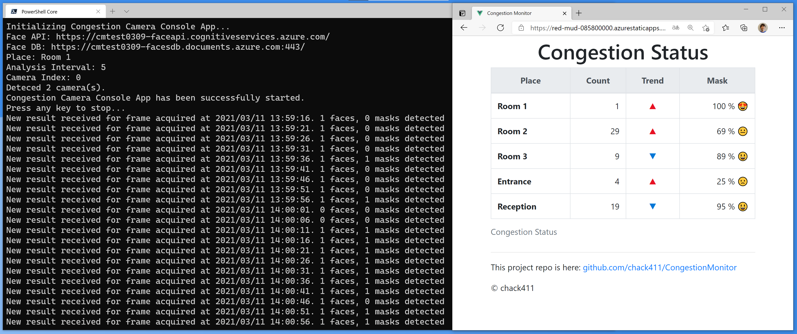
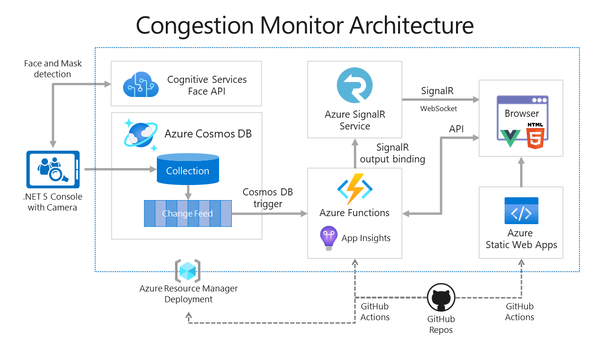

# Congestion Monitor

This repo is the Congestion Monitor project to detect congestion situations through web cameras in real-time.

In 2020, I realized that I have created a demo for my customer in 2019 that the application is to detect faces and to show the number and the trend on the browser in realtime. Now, we are facing the COVID-19 situation, and the demand for congestion monitoring is getting higher. So, I decided to rebuild the demo application that I've created and to publish the repo as an Open Source.

One of the important things is that most people have a mask on the face right now, so the capability of mask detection is required such an application. Fortunately, the Azure Cognitive Services - Face API can detect a face with a (small) mask. But, unfortunately, a large mask could result in no face being detected and the recognition rate with a mask is not good. But, if needed, you can replace face recognition with other AI services for the improvement of the recognition rate.



## Architecture



## Technology stack

* .NET 5
* Vue.js
* Azure Functions
* Azure SignalR Service
* Azure Cosmos DB
* Azure Cognitive Services
* Azure Static Web Apps
* Azure Application Insights
* Azure Resource Manager
* GitHub Actions
* (Azure DevOps)

## How to use source codes in this repo

This repo is setting up as a Template Repository. So, you can create a new GitHub repo from this repo at ["Use this template"](https://github.com/chack411/CongestionMonitor/generate).


After that, clone your repo on GitHub to your local environment and start to develop your own Congestion Monitor!

```sh
git clone https://github.com/<yourRepoName>/CongestionMonitor.git
```

## Deploy and run with this repo using Azure CLI and GitHub Actions

1. [Prepare environments and deploy with ARM template](Documentation/prep-deploy-with-arm-template.md)
1. [Build Congestion Camera Console App](Documentation/build-camera-console-app.md)
1. [Deploy Function App for Congestion Monitor](Documentation/deploy-function-app.md)
1. [Confrim Congestion Status on Static Web App](Documentation/comfirm-static-web-app.md)

## CI/CD deployment using Azure DevOps

If you are an Azure DevOps user, you can refer to Azure Pipeline YAML files in the `Pipelines` directory in this repo and can run pipelines for ARM deployment, Function App deployment, and building Console Camera app.

## Build Status

|Project|Status|
|---:|:---|
|Azure Functions App|[](https://github.com/chack411/CongestionMonitor/actions/workflows/azure-functions-apps.yml)|
|Static Web App|[](https://github.com/chack411/CongestionMonitor/actions/workflows/azure-static-web-apps-green-sky-0eff05900.yml)|

## Contributing

This project has adopted the [Microsoft Open Source Code of Conduct](https://opensource.microsoft.com/codeofconduct/). For more information see the [Code of Conduct FAQ](https://opensource.microsoft.com/codeofconduct/faq/) or contact [opencode@microsoft.com](mailto:opencode@microsoft.com) with any additional questions or comments.
